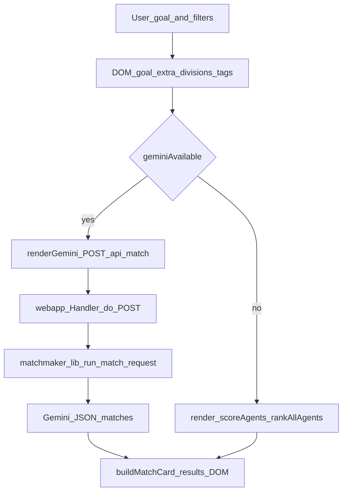
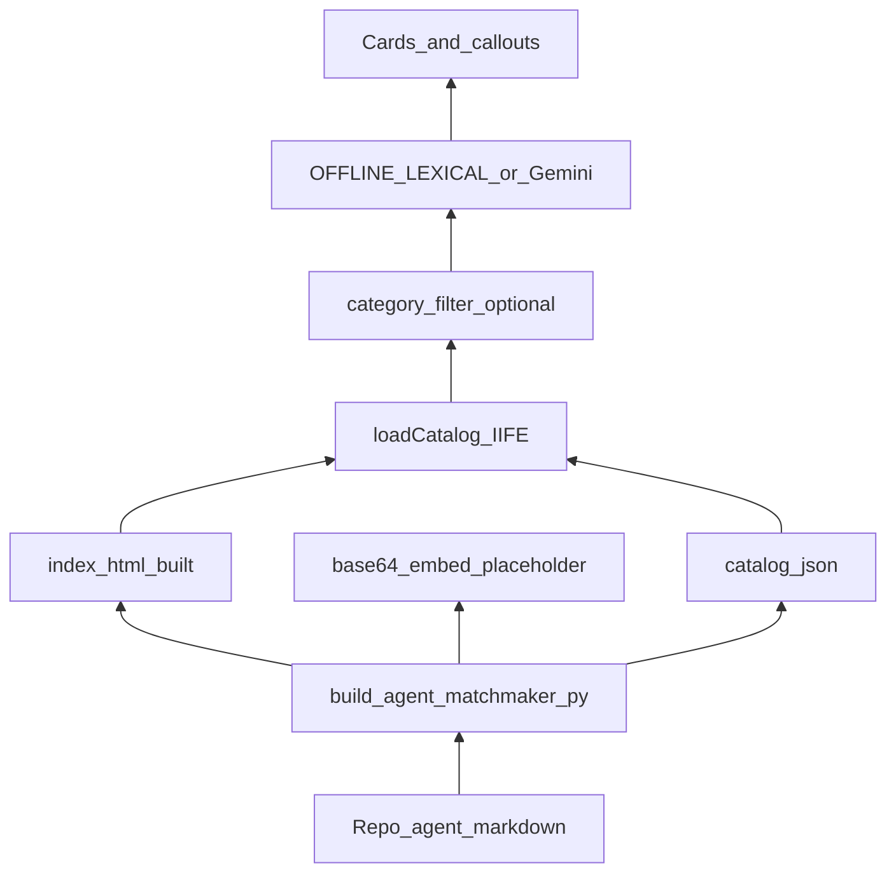

# Agent Matchmaker — dual trace (front-to-back and back-to-front)

This document gives two complementary views of the same system: **how user intent becomes rendered matches** (front-to-back), and **how repository artifacts become rankable data and UI** (back-to-front). Implementation lives under `agent-matchmaker/` and `scripts/build_agent_matchmaker.py`.

---

## Front to back (user → screen)

User actions drive the SPA IIFE in `agent-matchmaker/index.template.html` (built to `index.html`). Catalog must already be in memory (`CATALOG`).

| Step | Where | What happens |
|------|--------|----------------|
| 1 | Inputs | Goal textarea, optional extra context, division checkboxes (pool hints for Gemini; score boost offline), focus tags (offline only for lexical boosts). |
| 2 | `geminiAvailable()` | `file://` or AI toggle off or health denies key/SDK → offline branch. |
| 3a | `renderGemini` | `POST /api/match` with JSON body; loading state in `#results`. |
| 3b | `render` | `scoreAgents` → `rankAllAgents` over `OFFLINE_LEXICAL` + filters; `offlineSummaryFromList`, optional orchestration callout, `buildMatchCard` per row. |
| 4 | Response | Gemini: JSON `matches`, `summary`, optional orchestration fields, merged server-side ([WF-04](./WORKFLOW-04-api-match.md)). Offline: no network; structured fields synthesized in-browser ([WF-09](./WORKFLOW-09-offline-heuristic.md)). |
| 5 | Output | `#gemini-summary`, `#orchestrator-callout`, `#results-meta`, `#results` cards; follow-up panel on card expand uses `followUpAgents` (raw heuristic order). |

---

## Back to front (repo → bytes → rank → screen)

Markdown agents in the repo are compiled into JSON and an embeddable catalog for offline use; the same JSON feeds the server for Gemini pool construction.

| Step | Where | What happens |
|------|--------|----------------|
| 1 | `scripts/build_agent_matchmaker.py` | Walks configured agent dirs, parses frontmatter, emits `agent-matchmaker/catalog.json` and replaces `__AGENT_CATALOG_B64__` in the template output ([WF-02](./REGISTRY.md)). |
| 2 | Artifacts | `catalog.json` served on HTTP; `index.html` embeds base64 catalog for `file://` or fetch failure ([WF-07](./WORKFLOW-07-frontend-bootstrap.md)). |
| 3 | `loadCatalog` | Prefers `fetch("catalog.json")` on `http(s):`; else decodes embedded catalog. |
| 4 | Server path | `load_catalog` in `matchmaker_lib.py` reads `catalog.json`; `compact_agents` trims descriptions for the Gemini payload; `validate_and_merge` guards paths after the model returns. |
| 5 | Client rank | Offline: `OFFLINE_LEXICAL` + `rankAllAgents`. Online AI: model ranks the **filtered** pool from the same catalog semantics. |
| 6 | UI | `buildMatchCard` renders a unified card shape for both modes. |

---

## Quick crosswalk

| Concern | Front-to-back hook | Back-to-front hook |
|---------|--------------------|--------------------|
| Catalog truth | `CATALOG` in memory | `build_agent_matchmaker.py` → `catalog.json` / B64 |
| Division filters | Checkbox DOM | Serialized in POST `categories`; offline scoring +18 in-category |
| Orchestration hint | `#orchestrator-callout` | Gemini: model field; offline: regex + division count + catalog orchestrator row |
| Fit score | Card aside `N / 100` | Gemini: model `fit_score`; offline: `attachOfflineFitScores` rescales list |

## Related specs

- [WORKFLOW-04](./WORKFLOW-04-api-match.md)
- [WORKFLOW-07](./WORKFLOW-07-frontend-bootstrap.md)
- [WORKFLOW-09](./WORKFLOW-09-offline-heuristic.md)
- [REGISTRY](./REGISTRY.md)
